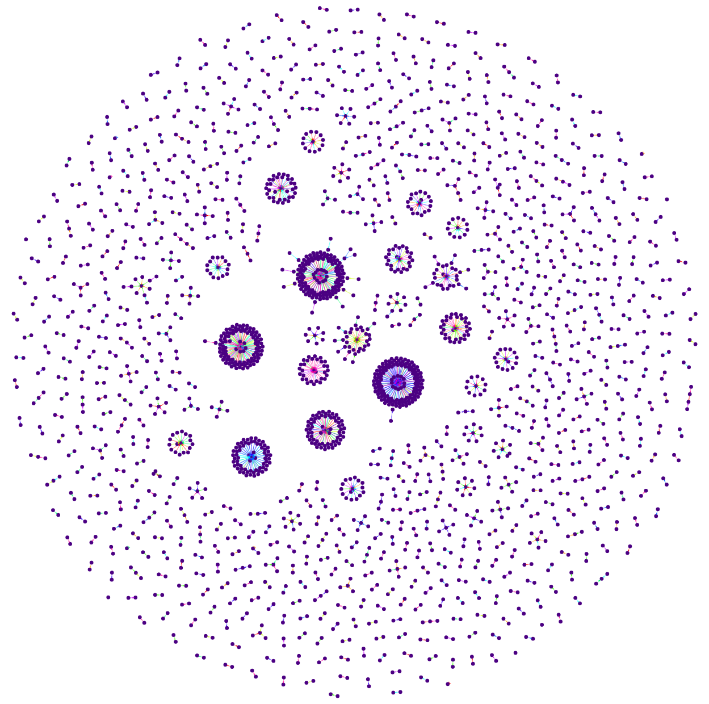

<h1 align="center"> Ethereum Transaction Graph</h1>

    

## Objective

To build a temporal (dynamic) graph representation of all transactions then leverage the deep learning framework 
dynamic graph neural networks / temporal graph neural networks to extract valuable insight from the transaction network at scale.

For an overview of dynamic graphs please see [_"Representation Learning for Dynamic Graphs: A Survey"_ by Kazemi, S. et.al.](https://www.jmlr.org/papers/volume21/19-447/19-447.pdf)

The aim is to classify either a single transactions (or wallet) or a series of transactions based on the relative
relations from both past and present interactions represented as a transaction graph that evolves over time from the
[Ethereum](https://ethereum.org/en/) blockchain network.

Typically, we divide the application cases in 3 parts:
 - edge classification/prediction (e.g. classify transactions), see [_"Temporal Graph Networks for Deep Learning on Dynamic Graphs"_ by Rossi, E. et.al.](http://arxiv.org/abs/2006.10637)
 - node classification/prediction (e.g. classifying wallet types/holders), [_"Influencer Detection with Dynamic Graph Neural Networks"_ Tiukhova, E. et.al.](https://arxiv.org/abs/2211.09664)
 - graph/subgraph classification/prediction (e.g. transaction load, anomalies) [_"Graph Neural Network-Based Anomaly Detection in Multivariate Time Series"_ by Deng, A. et.al.](https://arxiv.org/abs/2106.06947v1)

We have quite extensive experience applying these techniques to social networks (predicting future connections
via Twitter) and road networks (predicting traffic load in a sector of the network) and believe there is significant
value and insight to be added to the Ethereum network. Such use cases:

 - Peer Discovery
 - Network Anomaly detection

For You can find our contact details on our website [Machina Doctrina](www.machinadocrtina.com

## Transaction Graph Example 
### Blocks 16577361->16577370

    

to generate a live version of the graph run this [the transaction graph](TransactionGraph/transaction_graph.html) html

## This repository
This git repository is intended to contain both the transaction graph generation code and the Graph Neural Network
development code

### Best practices
It is required that before pushing that the staged commits __pass__ the `pre-commit`, this involves running

    pre-commit run

which will sanitise the currently staged commits according the repositories rules, this may require a few passes and
perhaps manual intervention (fixes). You should be able to run

    pre-commit run --all

without errors, if not please correct before creating a pull request!
These sanitary practices will aid in code readability and speed up pull requests.

Please also strive to write self documenting code or documentation strings were needed (sparingly)!

__Type hints__ are strongly encouraged!
