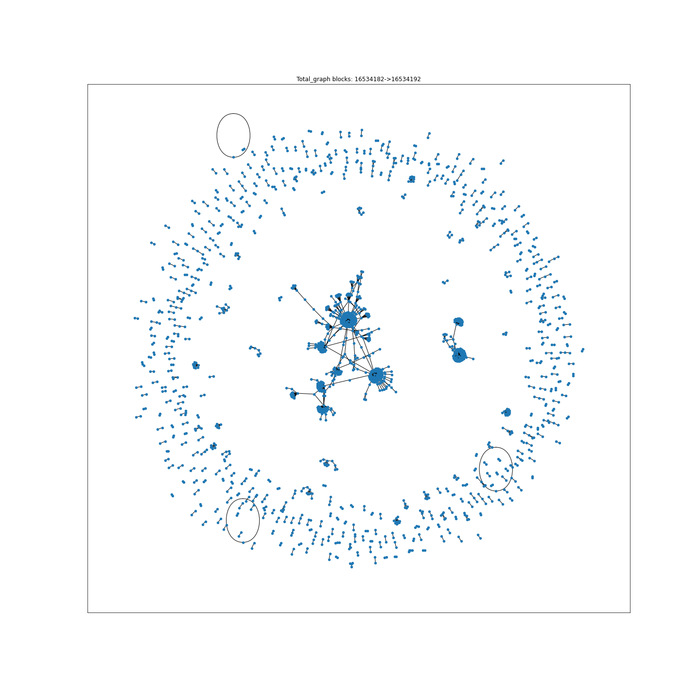

<h1 align="center"> Ethereum Transaction Graph</h1>

    

## Objective

To build a graph representation of all transactions using a Graph Neural Network, specifically a Graph Temporal
Neural Network (e.g. such as [arxiv.org/pdf/2006.10637.pdf](https://arxiv.org/pdf/2006.10637.pdf)).

The aim is to classify either a single transactions (or wallet) or a series of transactions based on the relative
relations from both past and present interactions represented as a transaction graph that evolves over time from the
[Ethereum](https://ethereum.org/en/) blockchain network.

Typically, we divide the application cases in 3 parts:
 - edge classification/prediction (e.g. classify transactions)
 - node classification/prediction (e.g. classifying wallet types/holders), and
 - graph/subgraph classification/prediction (e.g. transaction load, anomalies)

We have quite extensive experience applying these techniques to social networks (predicting future connections
via Twitter) and road networks (predicting traffic load in a sector of the network) and believe there is significant
value and insight to be added to the Ethereum network. Such use cases:

 - Peer Discovery
 - Network Anomaly detection

For You can find our contact details on our website [Machina Doctrina](www.machinadocrtina.com

## Transaction Graph Example

    

## This repository
This git repository is intended to contain both the transaction graph generation code and the Graph Neural Network
development code

### Best practices
It is required that before pushing that the staged commits __pass__ the `pre-commit`, this involves running

    pre-commit run

which will sanitise the currently staged commits according the repositories rules, this may require a few passes and
perhaps manual intervention (fixes). You should be able to run

    pre-commit run --all

without errors, if not please correct before creating a pull request!
These sanitary practices will aid in code readability and speed up pull requests.

Please also strive to write self documenting code or documentation strings were needed (sparingly)!

__Type hints__ are strongly encouraged!
